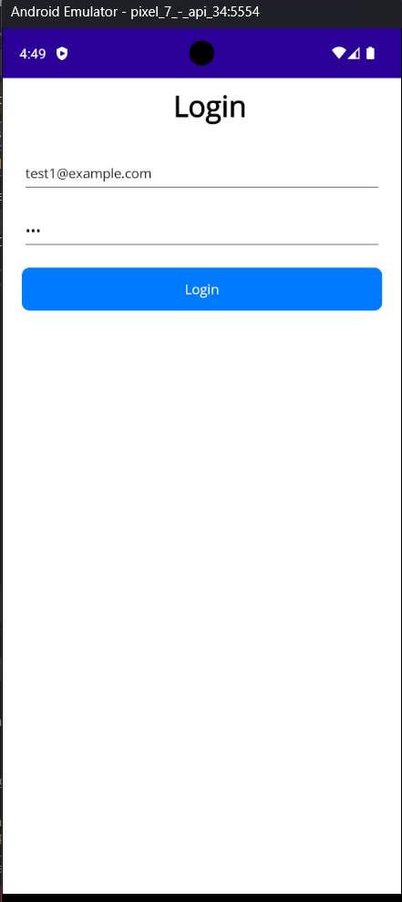

# MauiUsersApp

A simple user management application built with **.NET MAUI**.  
It allows user login, listing users, adding new users, editing existing users, and deleting users.  
All data is stored locally using **SQLite**.

## Prerequisites

- .NET 8 SDK
- Visual Studio 2022 or later
- .NET MAUI workload  
- Android SDK (if running on Android)

## Getting Started

1. Clone the repository.
2. Install the .NET MAUI workload (if not already installed)
3. Open the solution in Visual Studio 2022 (version 17.8 or later).
4. Select a target platform - Android Emulator or Physical Android Device.
5. Build and run the application.

## Seeded Users (Test Accounts)

When the application is launched for the first time, it automatically creates an SQLite database and inserts three sample users.

You can use this one for example to log in: 

Email: test1@example.com
Password: 123

## Screenshots

### Users Page

### Edit User Page

### Add User Page

### Login Page

### Login Failed

### Validation Error

### Delete Confirmation

### Successful Added
